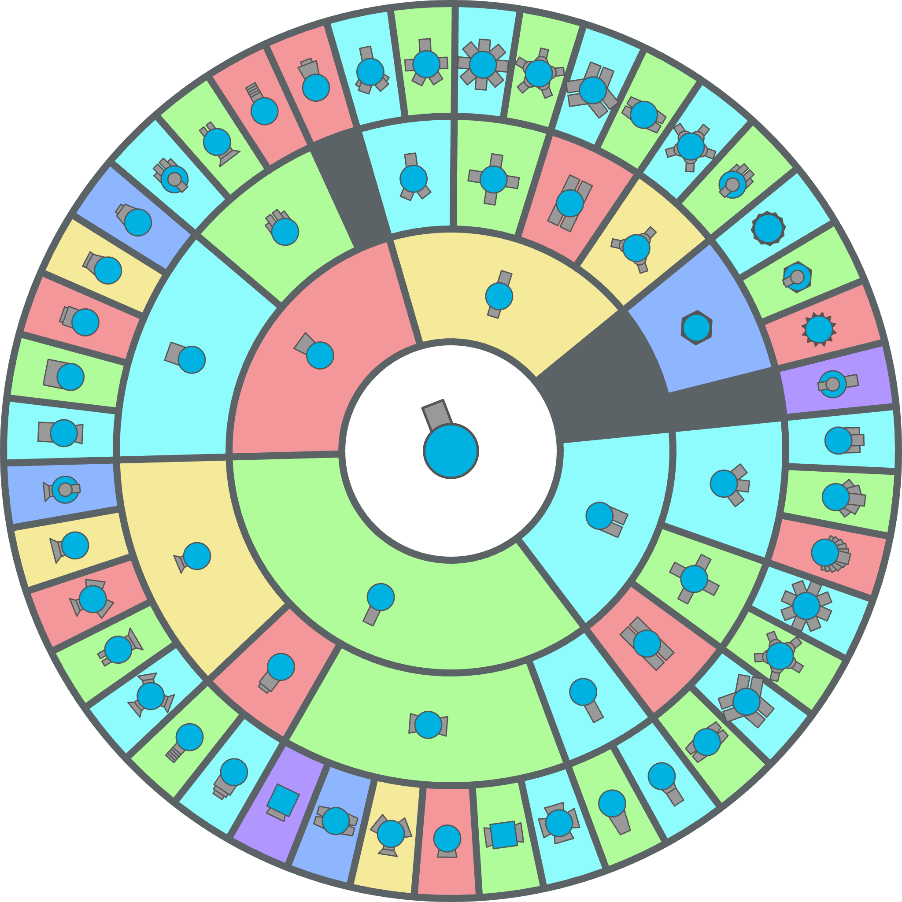

# diep.io Tree Visualizer
A library for visualizing trees in the style of the [diep.io](https://diep.io) tank evolution tree.

The following is generated using `tests/diep/diep.mts`:  


## Usage
Install the npm package:
```bash
npm install diep.io-tree-visualizer
```

This package exposes 2 classes:
- `Triep`: A class that holds the tree and handles the rendering
- `Tree`: A class that recursively holds children of its own type, forming a tree

A `Tree` object can be text or image, or it can be skipped in rendering. Pass the options to the constructor, or modify it after the objects creation:
```js
import { Tree } from "diep.io-tree-visualizer";

// If you have an image element
const img = document.querySelector("img");

// Passed as options
const tree = new Tree({
	skip: false, // Whether the tree node is blank (no background will be rendered)
	text: "hello", // Writes "hello" in the middle of the tree's section
	image: img, // Draws the image in the tree's section. Overrides "text"
	imageWidth: img.width, // Image width and height used to center the image in the tree
	imageHeight: img.height,
	color: "#fff", // The background color,
	angle: 0, // Rotated angle of the image/text (radian)
	scale: 1, // Scale of the image/text
}, /* Add Tree objects here as children */);

// Modify after creation
tree.angle = Math.PI;
tree.addChildren(/* Add Tree objects here as children */);
```

The `Triep` object holds the root node and the `render` method.
When the tree is set up, call render to draw on a canvas.
```js
import { Triep } from "diep.io-tree-visualizer";

const canvas = document.querySelector("canvas"); // Get a canvas somehow
const ctx = canvas.getContext("2d"); // Get the CanvasRenderingContext2D

const triep = new Triep();
triep.root.text = "I am root!"; // Modify root node attribute
triep.root.color = "#5b6366"; // SPECIAL! This changes the stroke of the entire tree circle
triep.root.addChildren(/* Add some children (Tree objects) */);

// Everything is set up. Render it!
// Order: ctx, x (center), y (center), radius, stroke width, angle (radian)
triep.render(ctx, 512, 512, 64, 4, 0);
```

### Using in Node.js
You can use most Node.js implementations of the Javascript Canvas API with this library, including `canvas` and `skia-canvas`.

Typescript may complain about the type of `CanvasRenderingContext2D`. In those cases, simply cast the Node context into `unknown`, then to `CanvasRenderingContext2D`:
```ts
import { Canvas } from "skia-canvas";

const canvas = new Canvas(1080, 1080);
const ctx = canvas.getContext("2d");

const triep = /* create a triep and setup stuff */;
triep.render(ctx as unknown as CanvasRenderingContext2D, 540, 540, 160, 16);
```

## Examples/Tests
Check the `tests/` directory for examples! You can also clone and run them:
```bash
git clone https://github.com/North-West-Wind/diep.io-tree-visualizer
cd diep.io-tree-visualizer
npm i
npm test
```

It will output the images to `tests/simple.png` and `tests/diep.png`.